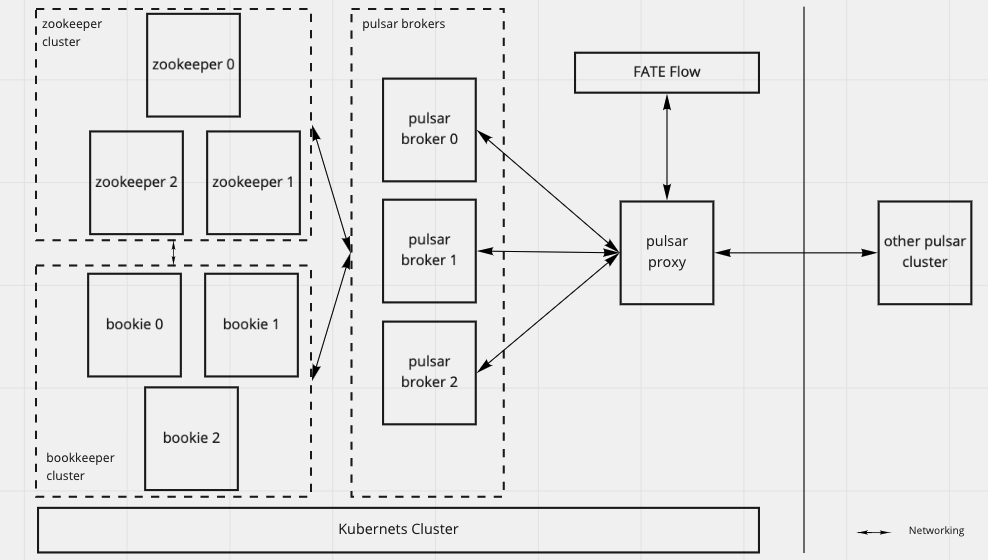

# Deploy Pulsar and ATS with HA property

## Usage of Certificate

Typically a FATE cluster requires at least one set of certificate for Pulsar service. Depends on the deployment, it is required the second certificate  for the ATS service.

There two types of deployment's architecture are as party A and party C of HA following shows.

<div style="text-align:center", align=center>

</div>


The services that required the certificates are:

- Pulsar proxy
- Pulsar broker
- ATS

Since the ATS is acting as a [SNI](https://en.wikipedia.org/wiki/Server_Name_Indication) proxy to route data between Pulsar clusters of different parties, it is necessary to unify the domain name.

For example, all Pulsar cluster routed by same ATS can have same domain name suffixing by "fml.org".

So that corresponding to FATE's party, the Pulsar cluster's domain name of party "9999" would be "9999.fml.org", which means the certificate used by this Pulsar's proxy should have "9999.fml.org" as it CN(common name).

Assumes the a user has following certificates ready:

1. the ca.key and ca.cert of a self-signed CA
2. the broker.key and broker.cert which signed by the CA
3. the exchange.key and exchange.cert which is also signed by the CA

The details about the generation of the above certificates if out of this document, user can refer to [Pulsar's official document](https://pulsar.apache.org/docs/en/security-tls-transport/#certificate-authority) of more details.

The service and it's corresponding certificates is as followed:

service name | key file | certificate file | certificate of CA
---|---|---|---
pulsar proxy | broker.key | broker.crt | ca.crt
pulsar broker | broker.key | broker.crt | ca.crt
ats | exchange.key | exchange.crt | ca.crt

Ideally, a user can generate an unique key/cert pairs for the pulsar proxy. However, to simplify the model, we reused the broker's certificate for pulsar proxy.

### Create Secret for Pulsar Proxy and Broker

To use the above certificates on Kubernetes, a user need to create the secret first.

Assumes a user is going to deploy a pulsar cluster named "pulsar-mini" in the "pulsar-cluster" namespace with helm chart. He should create the secret with following command before deploy the Pulsar cluster:

``` bash
# create corresponding secret of broker's cert
kubectl create secret generic --from-file=tls.crt=./broker.crt --from-file=tls.key=./broker.key pulsar-mini-broker-certs -n pulsar-cluster
 
# create corresponding secret of ca's cert
kubectl create secret generic --from-file=ca.crt=./ca.crt pulsar-mini-ca-tls -n pulsar-cluster
```

There are some **rules** need to be followed while creating the secret:

- the secret name of broker's cert must starts with "<<helm.release.name>>-", which is pulsar-mini in this example
- the secret name of ca'scert must be "<<helm.release.name>>-ca-tls"
- the keys must be "tls.crt" and "tls.key" for secret of broker's cert
- the keys must be "ca.crt" for secret of ca's cert

After the secret was created, a user can deploy the pulsar cluster with values described in Pulsar Deployment Yaml , the <<secret-name-for-broker>> should be replaced with the actual secret name, but without <<helm.release.name>> prefix. It would be **"broker-certs"** in this example.

### Create Secret for ATS

Currently, in FATE, an exchange is composed of a Nginx and ATS service, but only the ATS requires the certificates. Assumes a user is going to deploy a exchange to "fate-exchange" namespace. He should create the secret with following command first:

``` bash
kubectl create secret generic traffic-server-cert -n fate-exchange \
    --from-file=proxy.cert.pem=exchange.crt \
    --from-file=proxy.key.pem=exchange.key \
    --from-file=ca.cert.pem=ca.crt
```

The secret name and the keys should always be same as the above example.

## The HA Deployment of Pulsar

Typically, each FATE cluster is bound to a Pulsar cluster, KubeFATE has capability to deploy and mange a "standalone" Pulsar cluster for user.

However, if a user requires a production ready Pulsar cluster, he need to deploy the cluster manually with the [Pulsar helm chart](./pulsar-helm-charts/) we provided, which is developed based on the [Pulsar's official charts](https://github.com/apache/pulsar/blob/master/site2/docs/helm-deploy.md).

Assumes a user plans to deploy a FATE cluster in "fate-10000" namespace with a production ready Pulsar service, he should modify the `values.yaml` according to the following statements:

1. the "clusterName" must be "standalone";
2. the zookeeper and bookkeeper services are stateful, which should be persisted with existent storage class;
3. the node number of zookeeper and bookkeeper should equal or large than 3;
4. the "helm install" command must append "--set initialize=true" in the first time installation;
5. the "rbac.psp" must be enabled;
6. a certificate must be provided for pulsar(for more details about the certificate, please refer to usage of certificate)

After that, use the following command to deploy a Pulsar cluster:

``` bash
cd pulsar-helm-chart

helm install pulsar-standard charts/pulsar --set initialize=true -n fate-10000
```

The follow is an example of the "values.yaml", for more configurable items please refer to the official ["values.yaml"](https://github.com/apache/pulsar-helm-chart/blob/master/charts/pulsar/values.yaml).

``` yaml
clusterName: "standalone"
 
components:
  pulsar_manager: false
 
monitoring:
  grafana: false
   
rbac:
  enabled: true
  psp: true
 
tls:
  enabled: true
  broker:
    enabled: true
    cert_name: broker-certs
  proxy:
    enabled: true
    cert_name: broker-certs
 
volumes:
  persistence: true
 
affinity:
  anti_affinity: true
 
zookeeper:
  replicaCount: 3
  volumes:
    data:
      name: data
      size: 20Gi
      storageClassName:  {{ existent-storage-class }}
 
bookkeeper:
  replicaCount: 3
  volumes:
    journal:
      name: journal
      size: 10Gi
      storageClassName: {{ existent-storage-class }}
    ledgers:
      name: ledgers
      size: 10Gi
      storageClassName: {{ existent-storage-class }}
 
broker:
  replicaCount: 3
  configData:
    autoSkipNonRecoverableData: "true"
    managedLedgerDefaultEnsembleSize: "1"
    managedLedgerDefaultWriteQuorum: "1"
    managedLedgerDefaultAckQuorum: "1",
    brokerClientTlsEnabled: "true"
  volumes:
    persistence: false
 
proxy:
  replicaCount: 2
```

The FATE cluster is required to make adjustment to use the Pulsar service, the following example is illustrated such update.

``` yaml
name: fate-10000
namespace: fate-10000
chartName: fate
chartVersion: v1.6.1
partyId: 10000
registry: ""
imageTag: ""
pullPolicy:
imagePullSecrets:
- name: dockerhub
persistence: false
istio:
  enabled: false
podSecurityPolicy:
  enabled: false
modules:
  - mysql
  - python
  - fateboard
  - spark
  - hdfs
  - nginx
 
backend: spark
 
python:
  type: NodePort
  httpNodePort: 30090
  grpcNodePort: 30092
  pulsar:
    host: {{ .Release.Name }}-broker
    port: 6650
    mng_port: 8080
    proxy: {{ exchange ip:port }}
 
pulsar:
  route_table:
    10000:
      host: {{ .Release.Name }}-broker
      port: 6650
      sslPort: 6651
      proxy: ""
```

The service topology deployed by the above config is as follows(some service ignored):

<div style="text-align:center", align=center>

</div>

## The HA Deployment of Exchange

In FATE's start networking, the Exchange cluster is the center of the network. The Exchange cluster is composed of two services:

- An Nginx service to sync training pipeline among all parties;
- An ATS service to proxy data of Pulsar among all parties.

Since the above service is stateless, it's HA deployment is straightforward. A user can gain the HA property with scaling up the number for replica of the services in KubeFATE's cluster deployment file pulsar-cluster, an example of deployment is as follows:

``` yaml
name: fate-exchange
namespace: fate-exchange
chartName: fate-exchange
chartVersion: v1.6.1
partyId: 1
registry: ""
imageTag: "1.6.1-release"
persistence: false
istio:
  enabled: false
modules:
  - trafficServer
  - nginx
 
trafficServer:
  type: NodePort
  replicas: 3
  nodePort: 30001
  route_table:
    sni:
    - fqdn: 10000.fate.org
      # this should use external IP of pulsar's proxy
      tunnelRoute: 192.168.100.8:6651
 
nginx:
  nodeSelector:
  replicas: 3
  type: NodePort
  httpNodePort: 30003
  grpcNodePort: 30008
  route_table:
    10000:
      proxy:
        - host: 192.168.100.8
          http_port: 30083
          grpc_port: 30088
```
